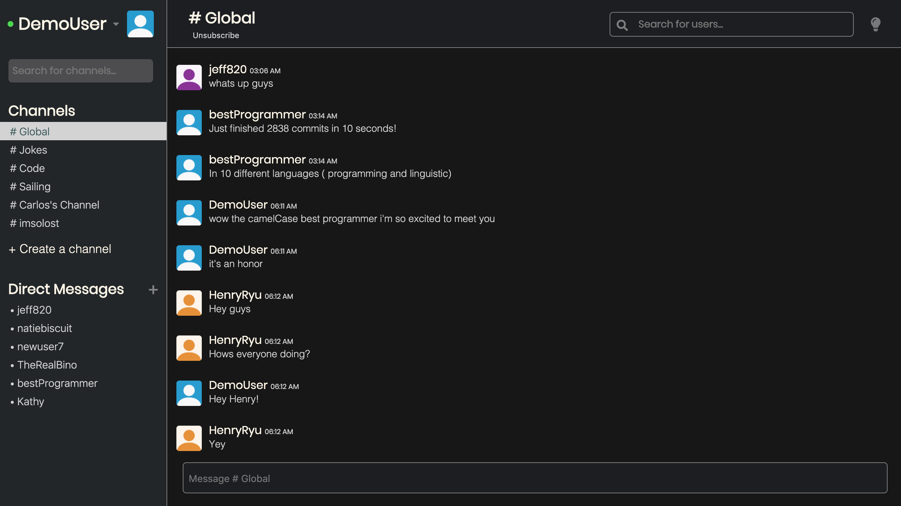

# README

## Stack

* Stack is a single page live messaging app inspired by Slack

* Technologies used:
  * Ruby on Rails
  * Action Cable/ Web Sockets
  * PostgresQL
  * React
  * Redux
  * Vanilla Javascript
  * AJAX
  * JSON

* Splash Page overview:
  * Looped video in background for a more interesting and lively experience
  * Nav bar holds links to Sign in and Sign up as well as a link back to the splash page
 


* Signup Page overview:
  * Allows you to create a new account
  * Validates presence of username, email
  * Validates length of password (min 6 characters)
  * Displays errors if those conditions aren't met
  * Allows anyone to sign is as a demo user and test functionality


* Signin Page overview:
  * Allows you to sign in to an existing account
  * Validates presence of email and password
  * Displays errors if fields were filled in incorrectly
  * Allows anyone to sign in as demo user and test functionality


* Client Main Page overview:
  * Sidebar component:
    * Renders a greeting with user's name and picture on a dropdown 
    * Dropdown contains logout and edit profile buttons as well as links to GitHub and LinkedIn
    * Channel search bar allows user to live search for already created channels and subscribe / unsubscribe
    * Renders a list of channels the user is subscribed to
    * Allows the user to create a new channel and auto-populate sidebar with new channel
    * Auto subscribes to created channel and stack_bot creates a welcome message

  * Channel render:
    * Renders all of the messages in the selected channel
    * Action Cable live chat allows users to view messages as they are submitted without having to refresh their page or request new data
    * Each message has a title that includes the user name, profile picture, and timestamp
    * Sleak message input form allows for easy integration in to the main feed



## Technical Overview of Live Chat

* Action Cable was intrduced to Ruby on Rails in version 5.0
* It allows the developer to create pub/sub servers for users to connect to
* When a user is connected to a channel there is an open stream of information from server to UI
* Every time a user creates a channel on Stack an instance of my ChatChannel is created and open to more users
* A user can subscribe to many instances of that channel, or "rooms"
* When a message is created and saved in Postgres it is broadcasted to that room and any other users who subscribe to that room will get a live update

* An example of the code that would broadcast the message after it is saved:
  * Here I grab the message and broadcast it to the room linked to the channelId and format the response in objects to be accessed on the front end

  ```
    if @message.save
            ActionCable
                .server
                .broadcast("room-#{@message.channel_id}:messages",
                message: {
                    id: @message.id,
                    body: @message.body,
                    userId: @message.user_id,
                    channelId: @message.channel_id,
                    createdAt: @message.created_at,
                },
                user: {
                    id: current_user.id,
                    username: current_user.username
                }
            );
  ```

* An example of the code that streams those broadcasted messages to the proper channel
  * I chose to make a listener component that lives on the client page and listens to changes in all of the user's channels
  * This component itterates over all subscriptions of the user on sign in and establishes a connection for each one
  * For each connection I have console logged a message that allows you to see which channels you are a part of and when they connect and disconnect (for testing and demonstration purposes)

  ```
    class Listener extends React.Component {
        constructor(props) {
            super(props);
            this.createSubscriptions = this.createSubscriptions.bind(this);
        }

        componentDidUpdate(prevProps) {
            if (prevProps.memberships.length) {
                this.createSubscriptions();
            }
        }

        createSubscriptions() {
            let memberships = this.props.memberships;

            this.chats = memberships.map(membership => (
                App.cable.subscriptions.create(
                    {
                        channel: "ChatChannel",
                        room: membership.channelId
                    },
                    {
                        connected: () => {
                            console.log(`Connected to ${membership.channelId}`);
                    },
                        disconnected: () => {
                            console.log("Disconnected!");
                    },
                        received: data => {
                            let payload = {
                                messages: {
                                    [data.message.id] : data.message
                                },
                                user: {
                                    [data.user.id] : data.user
                                }
                            }
                            if (!!payload) {
                                this.props.receiveNewMessage(payload);
                            }
                        }
                    }
                )
            ));
        }

        render() {
            return null;
        }
    }

    export default Listener;
  ```
